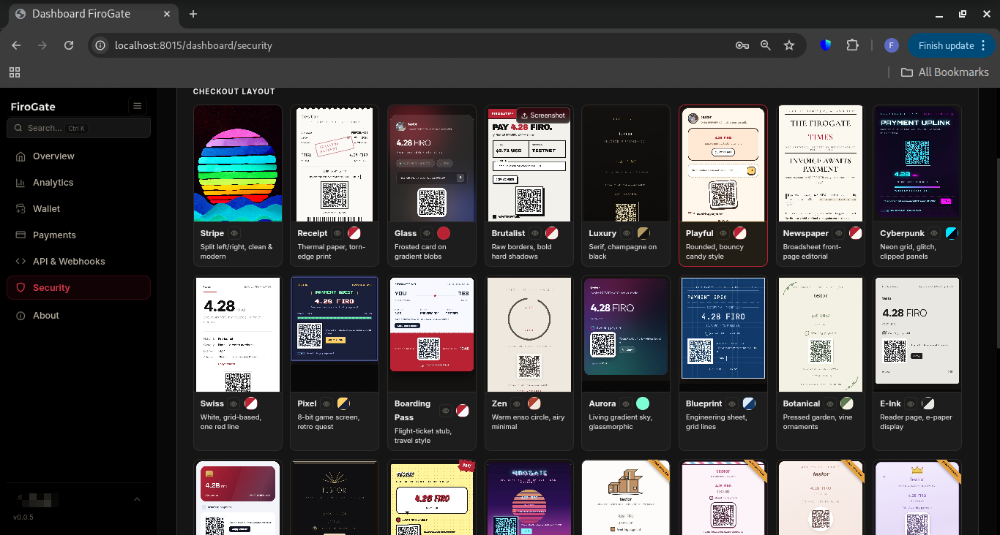
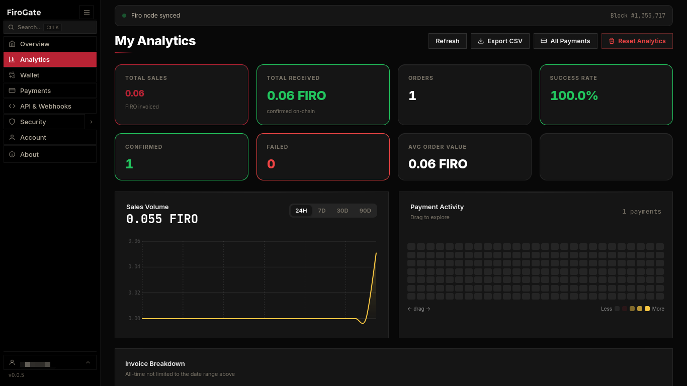

<div align="center">
  <h1>FiroGate</h1>
  <p><strong>Self-hosted, non-custodial private (Spark) Firo payment gateway</strong></p>
  <p>
    <a href="BUILD.md">Build & Run</a> ·
    <a href="AUDIT.md">Audit</a> ·
    <a href="SECURITY.md">Security</a> ·
    <a href="CONTRIBUTING.md">Contributing</a> ·
    <a href="LEGAL.md">Legal</a>
  </p>
  <br>
  
  
  
</div>

---

Accept private Firo (Spark) payments on your own server. FiroGate never holds funds and never holds spend authority: you connect a Spark **view key**, which can see incoming payments and nothing more.

<div align="center">
  <br>
  
  <p><em>30+ checkout themes, pick a look and it's live, no CSS</em></p>
  <br>
  
  <p><em>Built-in analytics: sales, confirmations, success rate, CSV export</em></p>
</div>

## How it works

Export a view key from your wallet, paste it in once. Every checkout gets a fresh one-time Spark address derived offline, no address pool, nothing to run out of. Your server watches the chain, decrypts what's yours, fires your webhook the moment a payment reaches your configured Confirmation Policy (default 2 confirmations, adjustable per merchant). `blocknotify` wakes the scanner instantly on every new block so detection doesn't wait on a timer, but confirmation depth — made safe by Firo's own ChainLocks — is the only thing that decides when a payment is final; InstantLock is intentionally not used (see [AUDIT.md](AUDIT.md)). Funds go straight to your wallet; FiroGate never touches them.

## What's included

- REST API: create payments, check status, list history
- Hosted checkout pages, no frontend work needed
- Webhooks: HMAC-SHA256 signed, auto-retry
- Payment Links: shareable no-code payment pages, unlimited
- Merchant dashboard: analytics, CSV export, API keys
- Scoped, revokable API keys
- Tor hidden service support
- Multi-language, including Arabic RTL
- Docker deploy
- Apache 2.0

## Get started

```bash
git clone https://github.com/firogate/firogate-ce.git
cd firogate
cp .env.example .env
# fill in your secrets, Firo RPC credentials, and OPERATOR_EMAILS
docker compose up -d
```

Full steps in **[BUILD.md](BUILD.md)**.

## Operator access

Set `OPERATOR_EMAILS=you@example.com` in `.env`: that account becomes the operator, no separate password. FiroGate CE is built for one operator running their own instance: you're both the operator and the merchant, everything unlimited, no plans or quotas.

See **[AUDIT.md](AUDIT.md)** for the full payment and wallet-connection trust model.

## API

Authenticated with a per-merchant API key (`X-API-Key` header), generated in the dashboard and stored as SHA-256 hashes only. Full reference in-app at `/docs`.

---

[Build & Run](BUILD.md) · [Audit](AUDIT.md) · [Security](SECURITY.md) · [Contributing](CONTRIBUTING.md) · [Legal](LEGAL.md) · [Changelog](CHANGELOG.md)

> Operators are solely responsible for complying with all applicable laws in their jurisdiction. See [LEGAL.md](LEGAL.md).

**License:** Apache-2.0
